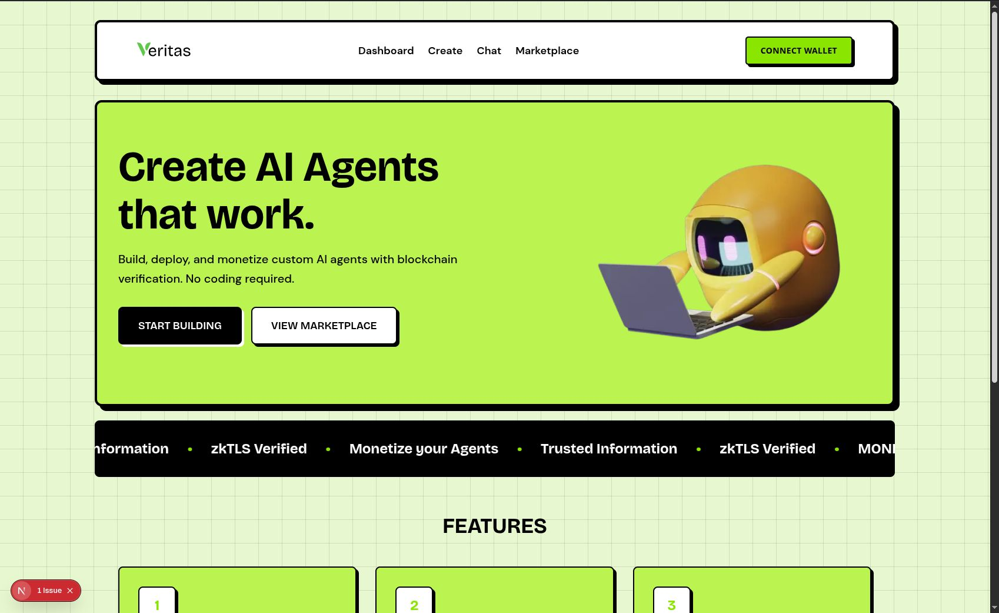
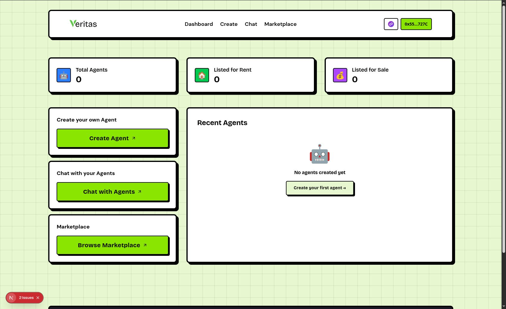
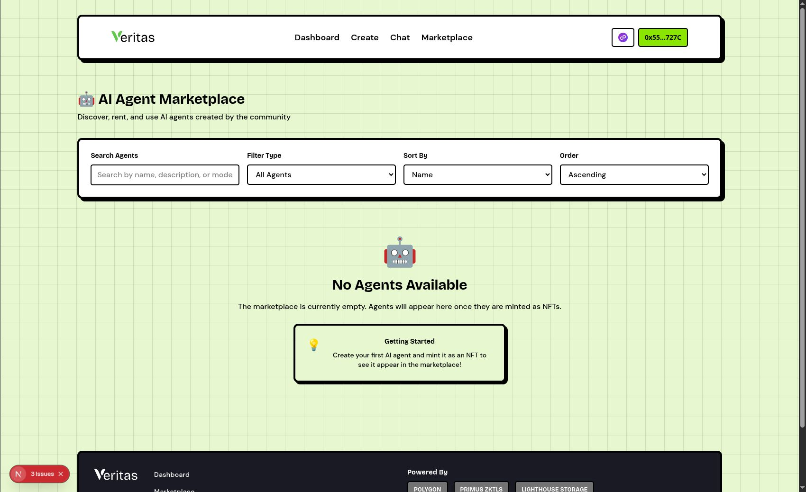
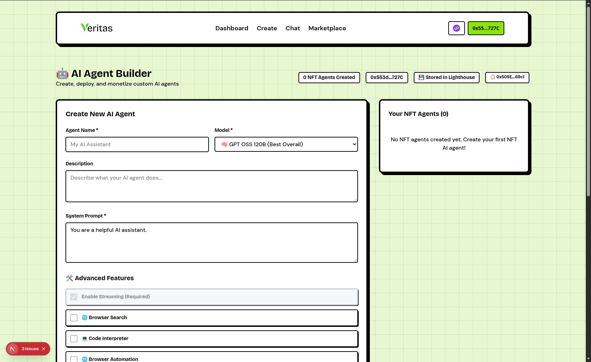

# Veritas AI

**Decentralized AI Agent Marketplace via zkTLS Verification**

[](https://opensource.org/licenses/MIT)
[](https://polygon.technology/)
[](https://ethglobal.com/events/newdelhi)

## Demo

https://github.com/user-attachments/assets/high.mp4

## Overview

Veritas is a revolutionary decentralized marketplace that transforms AI agents into tradeable digital assets, ensuring every interaction is authenticated through cutting-edge zero-knowledge technology. By combining blockchain infrastructure with advanced cryptographic verification, we create the first truly trustless AI ecosystem where human creativity is protected and monetized.

## Screenshots

| Hero Section | Dashboard |
|:---:|:---:|
|  |  |

| Marketplace | Dashboard View |
|:---:|:---:|
|  |  |

## Key Features

### zkTLS Verification System
- **Human Identity Proof**: Every wallet is cryptographically verified using Primus zkTLS technology
- **Zero-Knowledge Privacy**: Users prove they're human without revealing personal information
- **Anti-Bot Protection**: Prevents automated systems from flooding the marketplace
- **Persistent Verification**: 24-hour cached verification reduces friction while maintaining security

### AI Agent Creation & Management
- **No-Code Builder**: Intuitive interface for creating sophisticated AI agents without programming
- **Customizable Tools**: Web search, code execution, browser automation, Wolfram Alpha integration
- **Model Flexibility**: Support for various AI models with configurable parameters
- **IPFS Storage**: Decentralized storage ensures agents are permanently accessible

### Economic Model
- **NFT Ownership**: Each AI agent is minted as a unique NFT on Polygon blockchain
- **Rental Economy**: Agents can be rented for specific use cases with usage-based pricing
- **Direct Sales**: Complete ownership transfer for premium agents
- **Creator Royalties**: Ongoing revenue for original creators through smart contracts

### Trust & Security
- **Blockchain Verification**: Every transaction is recorded on Polygon for transparency
- **Cryptographic Integrity**: zkTLS ensures agent authenticity and prevents tampering
- **Decentralized Storage**: Lighthouse IPFS prevents single points of failure
- **Smart Contract Automation**: Trustless execution of rentals, sales, and payments

## Tech Stack

### Frontend
- **Next.js 14** with App Router
- **TypeScript** for type safety
- **Tailwind CSS** with custom neobrutalism design system
- **Custom Fonts**: Bricolage and DMSans

### Blockchain Infrastructure
- **Polygon Network** (Amoy Testnet) for low-cost, fast transactions
- **Ethers.js v6** for blockchain interactions
- **RainbowKit** for wallet connection and management
- **Hardhat** for smart contract development and deployment

### Storage & Verification
- **Lighthouse IPFS** for decentralized storage
- **Primus zkTLS** for zero-knowledge identity verification

## Smart Contracts

The platform uses several smart contracts deployed on Polygon Amoy testnet:

- **AgentNFT**: ERC-721 contract for AI agent tokenization
- **AgentMarketplace**: Handles rentals, sales, and payments
- **AgentFactory**: Creates and manages agent deployments

## Getting Started

### Prerequisites

- Node.js 18+
- pnpm or npm
- MetaMask or compatible Web3 wallet

### Installation

1. Clone the repository:
```bash
git clone https://github.com/Abhishek222983101/VeritasAi.git
cd VeritasAi
```

2. Install dependencies:
```bash
pnpm install
# or
npm install
```

3. Set up environment variables:
```bash
cp .env.example .env.local
```

4. Configure your `.env.local`:
```env
NEXT_PUBLIC_RPC_URL=your_polygon_rpc_url
NEXT_PUBLIC_CONTRACT_ADDRESS=your_contract_address
LIGHTHOUSE_API_KEY=your_lighthouse_api_key
PRIMUS_APP_ID=your_primus_app_id
```

5. Run the development server:
```bash
pnpm dev
# or
npm run dev
```

6. Open [http://localhost:3000](http://localhost:3000) in your browser.

### Smart Contract Deployment

1. Compile contracts:
```bash
npx hardhat compile
```

2. Deploy to Polygon Amoy:
```bash
npx hardhat run scripts/deploy.ts --network amoy
```

## User Journey

### For Creators:
1. **Connect & Verify**: Link wallet and complete zkTLS human verification
2. **Build Agents**: Use no-code interface to create custom AI agents
3. **Configure Tools**: Set up web search, code execution, and other capabilities
4. **Mint & List**: Convert agents to NFTs and list on marketplace
5. **Earn Revenue**: Receive payments from rentals and sales automatically

### For Users:
1. **Browse Marketplace**: Discover AI agents created by verified humans
2. **Rent or Buy**: Choose between temporary access or full ownership
3. **Execute Tasks**: Use agents for specific tasks with guaranteed authenticity
4. **Trust & Verify**: Every agent is cryptographically verified and human-created

## Market Impact

- **Democratizes AI**: Makes advanced AI accessible to non-technical users
- **Protects Creators**: Ensures human creators are fairly compensated
- **Prevents AI Misuse**: zkTLS verification prevents bot-generated content
- **Global Accessibility**: Polygon network enables worldwide participation
- **Sustainable Economy**: Creates long-term value for all participants

## Technical Innovation

- **First zkTLS AI Marketplace**: Pioneering use of zero-knowledge proofs in AI commerce
- **Human-Verified Content**: Only real humans can create and trade agents
- **Decentralized Trust**: No central authority controls the platform
- **Scalable Architecture**: Built for global scale with minimal transaction costs

## Project Structure

```
veritas-ai/
├── app/                    # Next.js app router pages
├── components/             # React components
├── contracts/              # Solidity smart contracts
├── artifacts/              # Compiled contract artifacts
├── scripts/                # Deployment scripts
├── lib/                    # Utility functions
├── public/                 # Static assets
├── typechain-types/        # TypeScript contract types
└── hardhat.config.ts       # Hardhat configuration
```

## Contributing

Contributions are welcome! Please feel free to submit a Pull Request.

## License

This project is licensed under the MIT License - see the [LICENSE](LICENSE) file for details.

## Acknowledgments

- Built at **ETHGlobal New Delhi**
- Powered by **Polygon**, **Lighthouse**, and **Primus zkTLS**

---

**Veritas AI** - Where human creativity is protected, verified, and monetized through cutting-edge cryptographic technology.
